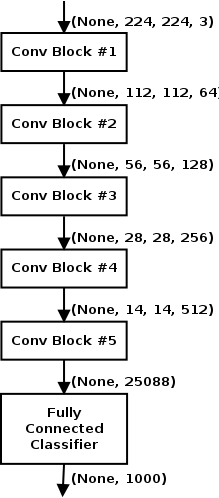
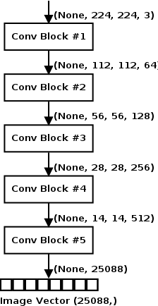
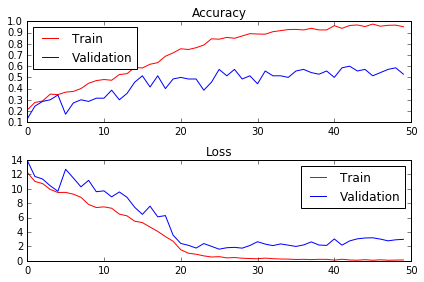
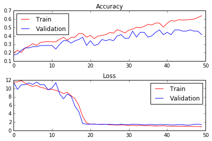
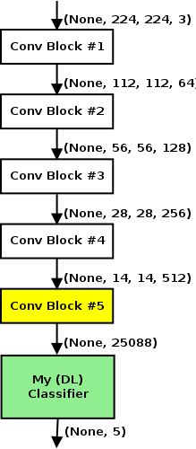
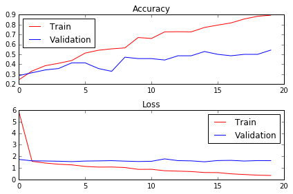
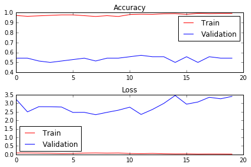

# Transfer Learning and Fine Tuning for Cross Domain Image Classification with Keras

Supporting code for my talk at [Accel.AI](http://accel.ai/) Demystifying Deep Learning and AI event on November 18-19 2016 at Oakland CA.

## Abstract:

I describe how a Deep Convolutional Network (DCNN) trained on the ImageNet dataset can be used to classify images in a completely different domain. The intuition that the training process teaches the DCNN to extract good features from images is explored with visualizations. Transfer Learning freezes the bottom layers of the DCNN to extract image vectors from a training set in a different domain, which can then be used to train a new classifier for this domain. Fine tuning involves training the pre-trained network further for the target domain. Both approaches are demonstrated using a VGG-16 network pre-trained on ImageNet to classify medical images into 5 categories. Code examples are provided using Keras.

## Dataset

Dataset used comes from [Diabetic Retinopathy Detection competition](https://www.kaggle.com/c/diabetic-retinopathy-detection) on Kaggle. Dataset is a set of 35,126 of digital color fundus photographs of the retina. The code here uses a sample of 1,000 images sampled from this dataset, 200 per each of the 5 Diabetes Retinopathy images (No DR, Mild DR, Moderate DR, Severe DR and Proliferative DR). See the [data/README.md](data/README.md) for details.

## VGG-16 Model

## Results

### Transfer Learning

### Transfer Learning + Logistic Regression

Result (based on Cohen's Kappa score) places this entry at position 79-80 on public leaderboard (as of Nov 9 2016).

    Accuracy: 0.36333, Cohen's Kappa Score: 0.51096

    Confusion Matrix:
    [[15 19 17  9  0]
     [20 24 10  5  1]
     [12 13 13 12 10]
     [ 7  4 11 24 14]
     [ 4  2 11 10 33]]

    Classification Report:
                 precision    recall  f1-score   support
    
              0       0.26      0.25      0.25        60
              1       0.39      0.40      0.39        60
              2       0.21      0.22      0.21        60
              3       0.40      0.40      0.40        60
              4       0.57      0.55      0.56        60
    
    avg / total       0.36      0.36      0.36       300

### Transfer Learning + 1 layer MLP

Result (based on Cohen's Kappa score) places this entry at position 25-26 on public leaderboard (as of Nov 9 2016).

    Final Model (DL#1)

    Accuracy: 0.66667, Cohen's Kappa Score: 0.74558

    Confusion Matrix:
    [[40  6  8  0  0]
     [ 5 46 12  2  0]
     [ 7  5 46  4  2]
     [ 5  5  8 31 11]
     [ 2  3  6  9 37]]

    Classification Report:
                 precision    recall  f1-score   support
    
              1       0.68      0.74      0.71        54
              2       0.71      0.71      0.71        65
              3       0.57      0.72      0.64        64
              4       0.67      0.52      0.58        60
              5       0.74      0.65      0.69        57
    
    avg / total       0.67      0.67      0.67       300
    

### Transfer Learning + 2 layer MLP

Results in lower performance than 1 layer MLP. Other tuning was to increase batch size, use Adadelta optimizer with lower learning rate. Network is slower because of additional layer and slightly worse in performance than 1 layer.

    Final Model (DL#2)

    Accuracy: 0.63333, Cohen's Kappa Score: 0.70822

    Confusion Matrix:
    [[36 11  4  1  2]
     [13 45  4  1  2]
     [ 5 15 35  5  4]
     [ 5  8  6 31 10]
     [ 4  1  3  6 43]]

    Classification Report:
                 precision    recall  f1-score   support
    
              1       0.57      0.67      0.62        54
              2       0.56      0.69      0.62        65
              3       0.67      0.55      0.60        64
              4       0.70      0.52      0.60        60
              5       0.70      0.75      0.73        57
    
    avg / total       0.64      0.63      0.63       300
    

### Fine Tuning

### Fine Tuning with Random Weights for FC

Result (based on Cohen's Kappa score) places this entry at position 26-27 on public leaderboard (as of Nov 9 2016).

    Final Model (FT#1)

    Accuracy: 0.61667, Cohen's Kappa Score: 0.74487

    Confusion Matrix:
    [[32  7 10  4  1]
     [13 37 11  4  0]
     [ 7  3 45  6  3]
     [ 1  4  8 32 15]
     [ 0  3  3 12 39]]

    Classification Report:
                 precision    recall  f1-score   support
    
              0       0.60      0.59      0.60        54
              1       0.69      0.57      0.62        65
              2       0.58      0.70      0.64        64
              3       0.55      0.53      0.54        60
              4       0.67      0.68      0.68        57
    
    avg / total       0.62      0.62      0.62       300

### Fine Tuning with Learned Weights for FC

Result (based on Cohen's Kappa score) places this entry at position 32-33 on public leaderboard (as of Nov 9 2016).

    Final Model (FT#2)

    Accuracy: 0.63000, Cohen's Kappa Score: 0.72214

    Confusion Matrix:
    [[34 11  6  2  1]
     [ 5 49  8  3  0]
     [ 6 12 40  5  1]
     [ 3  9 10 30  8]
     [ 1  3  7 10 36]]

    Classification Report:
                 precision    recall  f1-score   support
    
              0       0.69      0.63      0.66        54
              1       0.58      0.75      0.66        65
              2       0.56      0.62      0.59        64
              3       0.60      0.50      0.55        60
              4       0.78      0.63      0.70        57
    
    avg / total       0.64      0.63      0.63       300

## References

* [How to use pre-trained models with Keras](https://keras.io/getting-started/faq/#how-can-i-use-pre-trained-models-in-keras) - Keras documentation by Francois Chollet.
* [Keras Applications (pretrained Deep Learning Models)](https://keras.io/applications/) - Keras documentation by Francois Chollet.
* [Keras Blog: Building Powerful Image Classification Models using very little data](https://blog.keras.io/building-powerful-image-classification-models-using-very-little-data.html) - blog post by Francois Chollet, creator of Keras.
* [KDNuggets: Recycling Deep Learning Representations with Transfer Learning](http://www.kdnuggets.com/2015/08/recycling-deep-learning-representations-transfer-ml.html) - blog post by Zachary Chase Lipton.
* [Deep Neural Networks in Azure: Transfer Learning and Fine Tuning](https://info.microsoft.com/CO-AAIoT-WBNR-FY17-09Sep-27-Deep-Neural-Networks-in-Azure-Transfer-Learning-and-Fine-tuning-253624_Registration.html) - webinar presented by Anusua Trivedi of Microsoft.
* [The Neural Network Zoo](http://www.asimovinstitute.org/neural-network-zoo/) - blog post by Fjodor Van Veen of The Asimov Institute.

